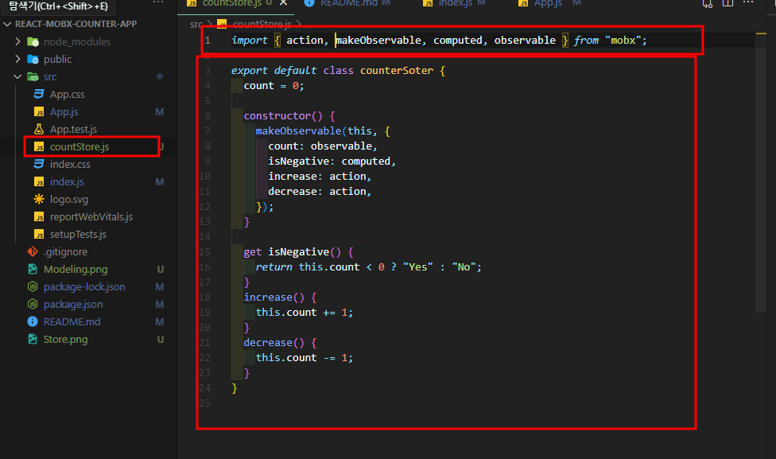
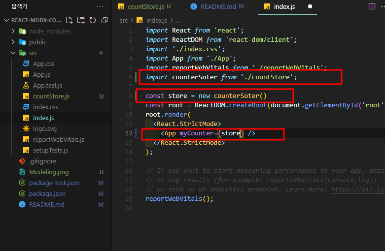
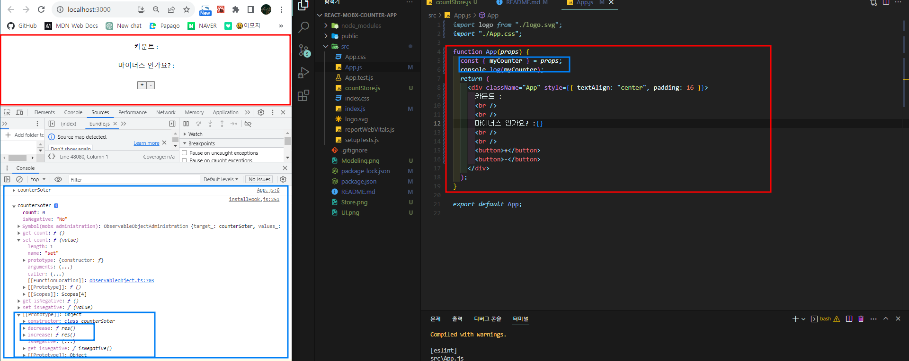
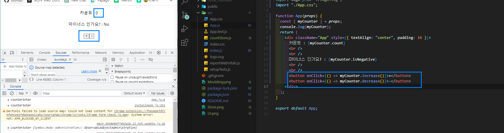
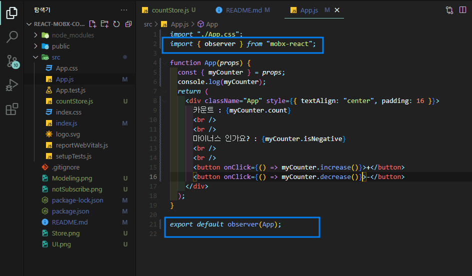
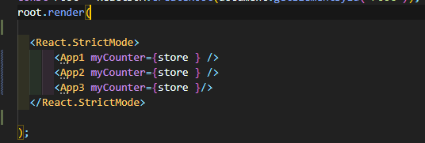
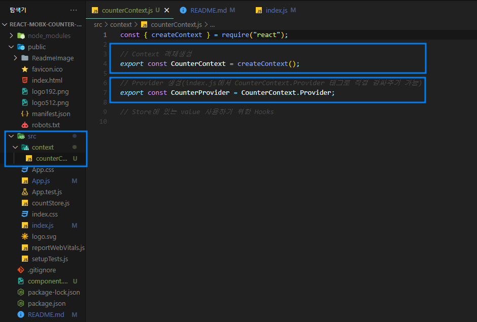
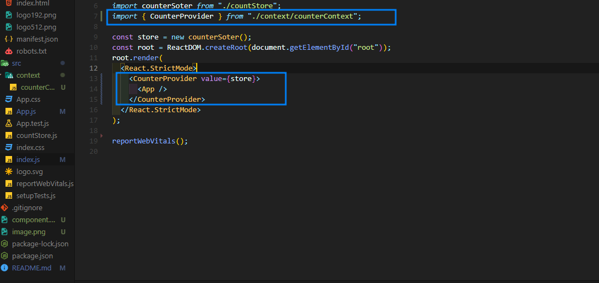
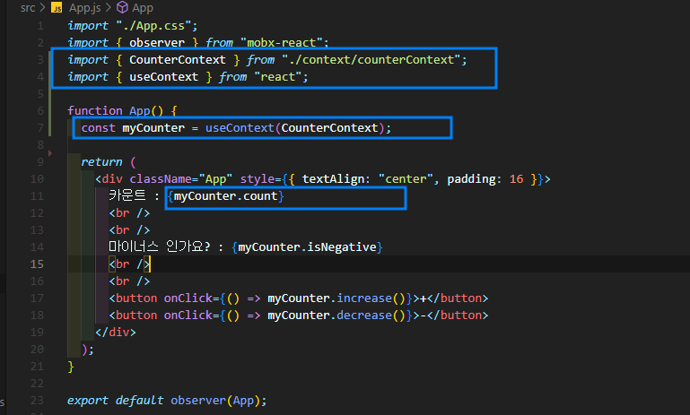

# MobX 사용하여 Counter App 만들기
[MobX 관련 Tistory 정리 바로보기](https://eunsoly.tistory.com/73)

1. 설치

```
npm i mobx
```

2. 애플레키에션 상태 모델링

```
makeObservable(this,{})
```

> makeObservable : 속성(property), 모든 객체 , 배열, map과 set은 observable로 설정될 수 있다. 객체를 observable로 만드는 가장 기본적인 방법은 makeObservable을 사용하여 속성마다 주석을 지정하는 것이다.



> observable : state를 저장하고 추적가능한 필드를 정의한다.  
> action : state를 수정하는 메서드를 표시한다.  
> computed : state로 부터 새로운 사실을 도출하고 그결괏값을 캐시하는 getter를 나타낸다.

3. 컨포넌트에서 사용할 수 있도록 내려주기
   

4. 사용자 인터페이스 생성 및 store연결 확인
   

5. 아래와 같은 porps의 메서드 전달로만은 제대로 작동하지 않음

   > 이유는? conuter를 사용하는 컴포넌트가 실제 값이 변경되고 있는 store를 구독하고 있지 않기 때문  
   >   
   > observer를 사용하여 컴포넌트가 store를 구독한 상태를 만들어 줘야한다
   >
   > ### observer를 사용을 위해 mobx-react 또는 mobx-react-lite 라이브러리를 설치필요

   ```
   npm i mobx-react
   ```

   

   > observer : Observer Hoc는 렌더링 중에 사용되는 모든 Observer에 React 구성 요소를 자동으로 구독, 결과적으로 관련 Observer 항목이 변경되면 Componenet가 자동으로 다시 렌더링 되고 관련 변경사항이 없을 땐 Componenet가 재렌더링 되지 않는다. 따라서 Compoenet에서 접근 할 수 있지만 실제로 읽지 않는 Observable은 재렌더링 되지 않는다.

---

### context함께 사용해서 하위 컴포넌트에 store전달 효율성 늘려주기

context를 함께 사용하는게 왜 좋을까?  
여러 컴포넌트에서 사용시 반복적으로 store를 내려줘야하는 상황이 발생  


때문에 Reactcontext를 사용하여 Provider로 감싸진 하위 트리 컴포넌트에 observable를 공유할 수 있기 때문에 효율성 증가

1. context생성
   

2. context.Provider을 사용하여 하위 트리로 전달
   

3. 컴포넌트에서 사용하기
   

context에서 Store에 있는 value 사용하기 위한 Hooks를 설정하여 내려주기 가능

```
// counterContext.js
const { createContext } = require("react");

export const CounterContext = createContext();
export const useCounterStore = ()=> useContext(CounterContext)

// App.js
import {useCounterStore} from "./context/counterContext"
const myCounter = useCounterStore();
```

> 위의 코드처럼도 사용가능
